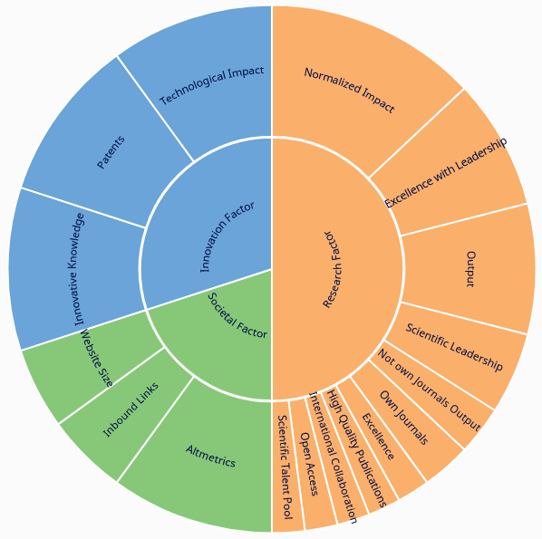

# Assessment of the volume and scope of scientific publications of Moroccan universities
In this project, we levereged Scimago Institutions Rankings, Google Scholar Citations data and Power BI to evaluate Moroccan universities (12 universities) rankings on four indicators (research, innovation, societal and professors citations).

The first part of this evaluation concerns Moroccan universities in the period 2009-2021, and their rankings in Morocco, Africa, Arab countries and in the world, by subject area. While the second part concerns the volume of scientific publications of the professors of the four best ranked Moroccan universities in each classification category.

* [Data collection and methodology](#data-collection-and-methodology)
  * [The SCImago Institutions Rankings (SIR)](#the-scimago-institutions-rankings-(sir))  
  * [Indicators](#indicators)
  * [Google Scholar citations search](#google-scholar-citations-search)

## Data collection and methodology
To carry out an coherent evaluation of Moroccan universities, which has as main characteristic "the veracity" (the veracity of the source, of the data and of the analysis), we have specified [The SCImago Institutions Rankings (SIR)](https://www.scimagoir.com/) as the main source of ranking data.

### The SCImago Institutions Rankings (SIR) 
The SCImago Institutions Rankings (SIR) is a classification of academic and research-related institutions ranked by a composite indicator that combines three different sets of indicators based on research performance, innovation outputs and societal impact measured by their web visibility.

For the ranking purposes, the calculation is generated each year from the results obtained over a period of five year ending two years before the edition of the ranking. For instance, if the selected year of publication is 2021, the results used are those from the five year period 2015-2019. The only exception is the case of web indicators which have only been calculated for the last year.

Read more: [Ranking Methodology](https://www.scimagoir.com/methodology.php)

### Indicators 
Indicators are divided into three groups intended to reflect scientific, economic and social characteristics of institutions. The SIR includes both, size-dependent and size-independent indicators; that is indicators influenced and not influenced by the size of the institutions. In this manner, the SIR provides overall statistics of the scientific publication and other output of institutions, at the same time that enables comparisons between institutions of different sizes. It needs to be kept in mind that, once the final indicator has been calculated out of the combination of the different indicators (to which a different weigh has been assigned) the resulting values have been normalized on a scale of 0 to 100. 

Source: [Ranking Methodology](https://www.scimagoir.com/methodology.php)

### Google Scholar citations search 
[Google Scholar citations search](https://scholar.google.com/citations?view_op=search_authors) is our second data source for collecting professors' reasearch data (last name, first name, citations, affiliation, subject area) according to their number of citations and their universities of affiliation.

Here is the research data for the four best ranked Moroccan universities that have been levereged:
* [Cadi Ayyad University](https://scholar.google.com/citations?view_op=view_org&org=10696271937461036765&hl=en&oi=io)
* [Mohamed 5 University](https://scholar.google.com/citations?view_op=search_authors&hl=en&mauthors=um5&before_author=t8bD_6cQAAAJ&astart=0) 
* [Mohamed Premier University](https://scholar.google.com/citations?view_op=search_authors&hl=en&mauthors=universite+mohamed+premier&before_author=5Nvm_xcGAAAJ&astart=0) 
* [Hassan 2 Univerity of Casablanca](https://scholar.google.com/citations?view_op=search_authors&hl=en&mauthors=universite+hassan+2&before_author=wvup_6EIAAAJ&astart=0) 
